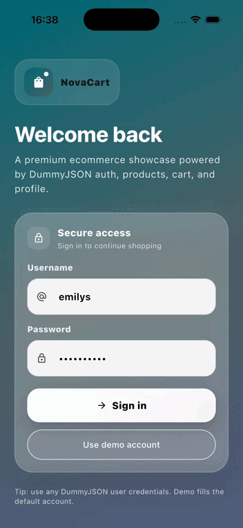

# Flutter Ecommerce Showcase

A production-minded Flutter ecommerce demo built on top of DummyJSON.

## Demo



## What this repo demonstrates

- Feature-first architecture with explicit `core`, `shared`, and `features` boundaries
- Repository pattern with domain/data separation
- Riverpod-driven state management
- GoRouter shell navigation with bottom tabs
- Dio networking with automatic token refresh and request retry
- Production-style loading, empty, and error states
- Infinite scroll product listing
- Login, profile, cart, product detail, and home flows wired to real DummyJSON endpoints

## Tech Stack

- Flutter
- Riverpod
- GoRouter
- Dio
- Cached Network Image
- Shimmer
- ScreenUtil

## Architecture

The project uses a feature-first structure:

- `lib/core` for app-wide configuration, routing, network, and theme
- `lib/features` for modular business areas
- `lib/features/shared` for reusable widgets and UI helpers

Each feature follows the same pattern:

- `data` for remote sources, models, and repository implementations
- `domain` for entities, repository contracts, and use cases
- `presentation` for state, screens, and UI widgets

## Why this structure

The goal is not just to show a working tutorial app. The repo is shaped to reflect decisions that scale:

- network concerns live in one place
- auth tokens are stored separately from UI state
- routes are centralized
- features can evolve independently
- failure states are visible in the UI instead of being hidden

## Network layer

Networking is powered by a single Dio client in `lib/core/network/dio_client.dart`.

It provides:

- base URL from build-time config
- timeout defaults
- automatic `Authorization` header injection
- refresh-token retry on `401`
- one retry for transient network / server failures
- structured logging for debugging

### Environment config

The API base URL and a few runtime knobs are read through `--dart-define`:

```bash
flutter run \
  --dart-define=API_BASE_URL=https://dummyjson.com \
  --dart-define=API_TIMEOUT_SECONDS=15 \
  --dart-define=AUTH_SESSION_EXPIRES_IN_MINS=60 \
  --dart-define=ENABLE_HTTP_LOGGING=true
```

If no values are provided, the app falls back to sensible defaults.

## Data flow

1. UI triggers a provider or controller.
2. Controller calls a use case.
3. Use case delegates to a repository contract.
4. Repository implementation talks to a remote data source.
5. Remote data source uses Dio and maps JSON into models.
6. Domain entities flow back up to the UI.

## Product listing

The product list uses real pagination with infinite scroll:

- initial page loads with a shimmer state
- scrolling near the bottom loads the next batch
- end-of-list is handled explicitly
- load-more errors are shown separately from the initial load

## Auth flow

DummyJSON login is wired to:

- `POST /auth/login`
- `GET /auth/me`
- `POST /auth/refresh`

Access and refresh tokens are kept in an in-memory store so the app can retry authenticated requests automatically.

## Screens

- Login
- Home
- Shop / product list
- Product detail
- Cart
- Profile

## Run the app

```bash
flutter pub get
flutter run
```

## Notes

- The app is intentionally focused on architecture and product feel, not on exhaustive backend completeness.
- The current cache strategy is network-first with image caching. Local offline persistence can be added later without changing the feature boundaries.
